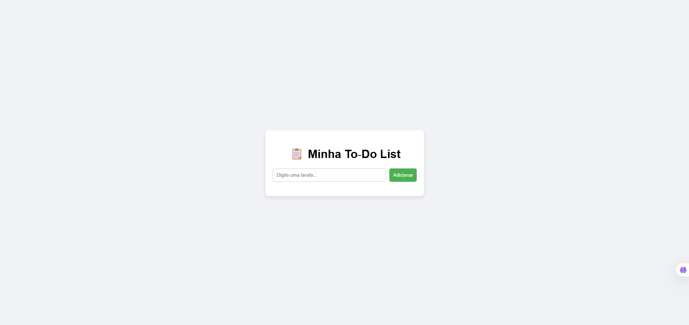

# 📋 To‑Do List

Projeto simples de **Lista de Tarefas** desenvolvido com **HTML, CSS e JavaScript** para praticar manipulação do DOM.

🔗 **Acesse o projeto online:**  
👉 [Clique aqui para ver a aplicação](https://marcusdba.github.io/todo-list/)

---

## 📸 Demonstração

Veja abaixo como a aplicação funciona:

---

## 🚀 Funcionalidades
- ➕ Adicionar novas tarefas
- 🗑️ Remover tarefas
- ⌨️ Suporte ao teclado (pressionar **Enter** também adiciona a tarefa)
- 🎨 Interface simples e responsiva

---

## 🛠️ Tecnologias Utilizadas
- HTML5
- CSS3
- JavaScript (Vanilla)
